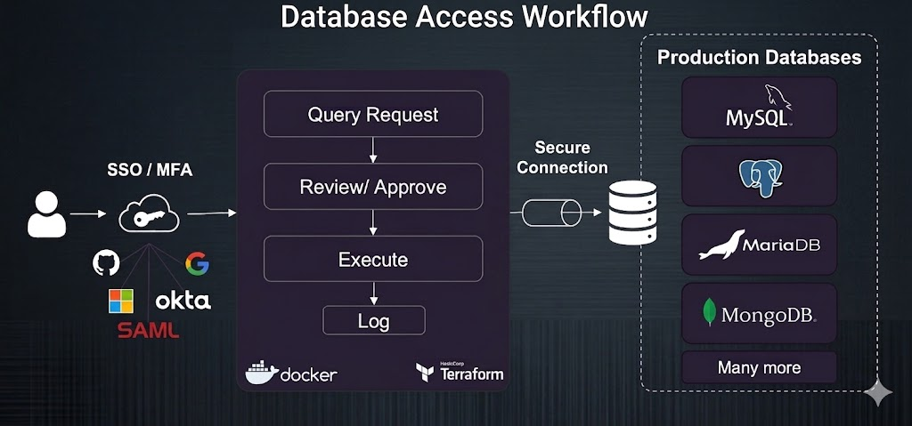

## YugabyteDB Anywhere (YBA)
YBA is the control plane for deploying and managing YugabyteDB universes (clusters) across AWS, GCP, Azure, Kubernetes, and on-prem.

```sh
React UI ──► Play (Java/Scala) backend ──► PostgreSQL (state)
                    │                       Prometheus (metrics)
                    ▼
          Commissioner (task engine)
                    │
        ┌───────────┼─────────────┐
        ▼           ▼             ▼
   Node-Agent   Ansible      Cloud APIs
   (gRPC)      (devops/)    (AWS/GCP/Azure/K8s)
```

### Request flow
- Play routes maps HTTP → controller action
- Controllers (e.g. UniverseActionsController.java) authenticate via `TokenAuthenticator`, validate input, delegate to a service/manager
- For long-running ops, the service calls `Commissioner.submit(...)` and immediately returns a task UUID
- Client polls GET `/tasks/{uuid}` for progress

### Talking to nodes — node-agent
Each managed node runs a small Go service (managed/node-agent/). YBA talks to it over `gRPC` instead of `SSH`:
- `ExecuteCommand`
- `ConfigureServer`
- `ConfigureService`
- `DownloadSoftware`
- `InstallSoftware`
- `ServerControl`
- `PreflightCheck`
- `Ping`

## Role Bindings
A RoleBinding is the join table that makes RBAC work. It encodes:

`Principal (user or group) → Role (set of permissions) → ResourceGroup (which resources)`

Without a binding, a Role is just a definition; nothing is granted until something is bound.

```sh
roleUUID, customerUUID, name, description
roleType: System | Custom
permissionDetails: { permissionList: Set<Permission> }
```
Roles are per-customer (multi-tenant) and hold a set of (`resourceType,` `action`) permission tuples — but no resource scope. That comes from the binding.

```sh
uuid, principal (FK), role (FK), resourceGroup (JSON)
type: System | Custom
createTime, updateTime
```

```sh
ResourceGroup {
  resourceDefinitionSet: Set<ResourceDefinition>
}
ResourceDefinition {
  resourceType: UNIVERSE | ROLE | USER | OTHER
  allowAll: boolean
  resourceUUIDSet: Set<UUID>   // when allowAll=false
}
```

Permissions are (ResourceType, Action) tuples defined in JSON:
- universeResourcePermissions.json — `CREATE`, `READ`, `UPDATE`, `DELETE`, `PAUSE_RESUME`, `BACKUP_RESTORE`, `XCLUSTER`, `DEBUG`, `TROUBLESHOOT`
- roleResourcePermissions.json — `CREATE`, `READ`, `UPDATE`, `DELETE`
- userResourcePermissions.json — `READ`, `CREATE`, `UPDATE_ROLE_BINDINGS`, `UPDATE_PROFILE`, `DELETE`
- otherResourcePermissions.json — `CREATE`, `READ`, `UPDATE`, `DELETE`, `SUPER_ADMIN_ACTIONS`

```java
//Fetch all bindings for this user 
List<RoleBinding> roleBindings = RoleBinding.fetchRoleBindingsForUser(user.getUuid());

List<RoleBinding> list = find.query().where().eq("principal_uuid", userUUID).findList();
list.forEach(rb -> rb.setUser(user));
Set<UUID> groupMemberships = user.getGroupMemberships();
if (groupMemberships == null) return Collections.unmodifiableList(list);
for (UUID groupUUID : groupMemberships) {
  Principal p = Principal.get(groupUUID);
  if (p == null) continue;
  list.addAll(getAll(groupUUID));
}
return Collections.unmodifiableList(list);
```

Play stores the session using a session cookie in the browser. When you are programming, you will typically access the session through the Scala API or Java API, but there are useful configuration settings.

Session and flash cookies are stored in JSON Web Token (JWT) format. The encoding is transparent to Play, but there some useful properties of JWT which can be leveraged for session cookies, and can be configured through application.conf. Note that JWT is typically used in an HTTP header value, which is not what is active here – `in addition, the JWT is signed using the secret, but is not encrypted by Play.`

`Redirect("/home").withSession("userId" -> "12345")`

This will result in a `PLAY_SESSION` cookie on the client with a signed payload like:
`PLAY_SESSION=someSignedDataRepresenting_userId=12345`

PLAY_SESSION + PlayCacheSessionStore
`PLAY_SESSION=sessionId=<someRandomSessionKey>`

```sh
docker pull software.yugabyte.com/yugabytedb/yugabyte:2025.2.2.2-b11
docker run -d --name yugabyte -p7000:7000 -p9000:9000 -p15433:15433 -p5433:5433 -p9042:9042  yugabytedb/yugabyte:2025.2.2.2-b11 bin/yugabyted start  --background=false
```

```java
//Field 'log' already exists.
[warn] @Slf4j
@Slf4j
public class OidcJwtValidation {

	private Logger log = LoggerFactory.getLogger(OidcJwtValidation.class);
}
// pick one
```




## YugabyteDB (the core database)
The actual distributed SQL database — the thing that stores and serves your data. It's made of two server processes:
- YB-Master — cluster metadata, tablet/shard placement, load balancing, DDL coordination (not on the data hot path).
- YB-TServer — stores and serves the actual data (tablets), handles reads/writes, hosts the YSQL (Postgres-compatible) and YCQL (Cassandra-compatible) APIs.


## yugabyted — the built-in, single-node-friendly launcher
A command-line daemon (yugabyted start …) that wraps yb-master + yb-tserver into one easy-to-run process. It's the "get started in one command" experience: it bootstraps a node, auto-configures flags, joins a cluster, and exposes health/status. 

yugabyted runs on every node, not just one
You form a cluster by running yugabyted start on each node and joining them:

```sh
# node 1 (first node — becomes the seed)
yugabyted start --advertise_address=10.0.0.1

# node 2
yugabyted start --advertise_address=10.0.0.2 --join=10.0.0.1

# node 3
yugabyted start --advertise_address=10.0.0.3 --join=10.0.0.1
```